# Self-Driving Car Engineer Nanodegree

## Deep Learning

## Project: Build a Traffic Sign Recognition Classifier

In this notebook, a template is provided for you to implement your functionality in stages, which is required to successfully complete this project. If additional code is required that cannot be included in the notebook, be sure that the Python code is successfully imported and included in your submission if necessary. 

> **Note**: Once you have completed all of the code implementations, you need to finalize your work by exporting the iPython Notebook as an HTML document. Before exporting the notebook to html, all of the code cells need to have been run so that reviewers can see the final implementation and output. You can then export the notebook by using the menu above and navigating to  \n",
    "**File -> Download as -> HTML (.html)**. Include the finished document along with this notebook as your submission. 

In addition to implementing code, there is a writeup to complete. The writeup should be completed in a separate file, which can be either a markdown file or a pdf document. There is a [write up template](https://github.com/udacity/CarND-Traffic-Sign-Classifier-Project/blob/master/writeup_template.md) that can be used to guide the writing process. Completing the code template and writeup template will cover all of the [rubric points](https://review.udacity.com/#!/rubrics/481/view) for this project.

The [rubric](https://review.udacity.com/#!/rubrics/481/view) contains "Stand Out Suggestions" for enhancing the project beyond the minimum requirements. The stand out suggestions are optional. If you decide to pursue the "stand out suggestions", you can include the code in this Ipython notebook and also discuss the results in the writeup file.


>**Note:** Code and Markdown cells can be executed using the **Shift + Enter** keyboard shortcut. In addition, Markdown cells can be edited by typically double-clicking the cell to enter edit mode.

---
## Step 0: Load The Data


```python
# Load pickled data
import pickle

# TODO: Fill this in based on where you saved the training and testing data

training_file = '../data/train.p'
validation_file='../data/valid.p'
testing_file = '../data/test.p'

with open(training_file, mode='rb') as f:
    train = pickle.load(f)
with open(validation_file, mode='rb') as f:
    valid = pickle.load(f)
with open(testing_file, mode='rb') as f:
    test = pickle.load(f)
    
X_train, y_train = train['features'], train['labels']
X_valid, y_valid = valid['features'], valid['labels']
X_test, y_test = test['features'], test['labels']
```

---

## Step 1: Dataset Summary & Exploration

The pickled data is a dictionary with 4 key/value pairs:

- `'features'` is a 4D array containing raw pixel data of the traffic sign images, (num examples, width, height, channels).
- `'labels'` is a 1D array containing the label/class id of the traffic sign. The file `signnames.csv` contains id -> name mappings for each id.
- `'sizes'` is a list containing tuples, (width, height) representing the original width and height the image.
- `'coords'` is a list containing tuples, (x1, y1, x2, y2) representing coordinates of a bounding box around the sign in the image. **THESE COORDINATES ASSUME THE ORIGINAL IMAGE. THE PICKLED DATA CONTAINS RESIZED VERSIONS (32 by 32) OF THESE IMAGES**

Complete the basic data summary below. Use python, numpy and/or pandas methods to calculate the data summary rather than hard coding the results. For example, the [pandas shape method](http://pandas.pydata.org/pandas-docs/stable/generated/pandas.DataFrame.shape.html) might be useful for calculating some of the summary results. 

### Provide a Basic Summary of the Data Set Using Python, Numpy and/or Pandas


```python
### Replace each question mark with the appropriate value. 
### Use python, pandas or numpy methods rather than hard coding the results
import numpy as np
# TODO: Number of training examples
n_train = len(X_train)

# TODO: Number of validation examples
n_validation = len(X_valid)

# TODO: Number of testing examples.
n_test = len(X_test)

# TODO: What's the shape of an traffic sign image?
image_shape = X_train[0].shape

# TODO: How many unique classes/labels there are in the dataset.
n_classes = len(set(np.concatenate((y_train,y_test,y_valid))))

print("Number of training examples =", n_train)
print("Number of testing examples =", n_test)
print("Image data shape =", image_shape)
print("Number of classes =", n_classes)
```

    Number of training examples = 34799
    Number of testing examples = 12630
    Image data shape = (32, 32, 3)
    Number of classes = 43


### Include an exploratory visualization of the dataset

Visualize the German Traffic Signs Dataset using the pickled file(s). This is open ended, suggestions include: plotting traffic sign images, plotting the count of each sign, etc. 

The [Matplotlib](http://matplotlib.org/) [examples](http://matplotlib.org/examples/index.html) and [gallery](http://matplotlib.org/gallery.html) pages are a great resource for doing visualizations in Python.

**NOTE:** It's recommended you start with something simple first. If you wish to do more, come back to it after you've completed the rest of the sections. It can be interesting to look at the distribution of classes in the training, validation and test set. Is the distribution the same? Are there more examples of some classes than others?


```python
### Data exploration visualization code goes here.
### Feel free to use as many code cells as needed.
import matplotlib.pyplot as plt
import random
# Visualizations will be shown in the notebook.
%matplotlib inline

index = random.randint(0, len(X_train))
print(index)
image = X_train[index].squeeze()

plt.figure(figsize=(1,1))
plt.imshow(image)
print(y_train[index])
```

    27613
    12


```python

from pandas.io.parsers import read_csv
signnames = read_csv("signnames.csv").values[:, 1]

def display_random_data(x,y,signnames,load_index = None):
    num_image_shown = 8
    sign_classes, class_indices, class_counts = np.unique(y, return_index = True, return_counts = True)
    
    # Save random index for comparsion
    save_index = np.zeros([len(sign_classes),num_image_shown])
    
    for c,c_index,c_count in zip(sign_classes, class_indices, class_counts):
        print('Class ',c,'--',signnames[c],' # Samples:',str(c_count))
        
        if load_index == None:
            random_index = random.sample(range(c_index,c_index+c_count),num_image_shown)
            save_index[c] = random_index
        else:
            random_index = (load_index[c]).astype(np.int32)
#         print(random_index)
        fig,axis = plt.subplots(1,num_image_shown,figsize=(20,22))
        for i in range(num_image_shown):
            axis[i].axis('off')
            axis[i].imshow(x[random_index[i]].squeeze(),cmap='gray')
        plt.show()
    return save_index
```

Here I display some random samples of the train set below


```python
saved_index = display_random_data(X_train,y_train,signnames)
```

    Class  0 -- Speed limit (20km/h)  # Samples: 180


    Class  1 -- Speed limit (30km/h)  # Samples: 1980


    Class  2 -- Speed limit (50km/h)  # Samples: 2010


    Class  3 -- Speed limit (60km/h)  # Samples: 1260


    Class  4 -- Speed limit (70km/h)  # Samples: 1770


    Class  5 -- Speed limit (80km/h)  # Samples: 1650


    Class  6 -- End of speed limit (80km/h)  # Samples: 360


    Class  7 -- Speed limit (100km/h)  # Samples: 1290


    Class  8 -- Speed limit (120km/h)  # Samples: 1260


    Class  9 -- No passing  # Samples: 1320


    Class  10 -- No passing for vehicles over 3.5 metric tons  # Samples: 1800


    Class  11 -- Right-of-way at the next intersection  # Samples: 1170


    Class  12 -- Priority road  # Samples: 1890


    Class  13 -- Yield  # Samples: 1920


    Class  14 -- Stop  # Samples: 690


    Class  15 -- No vehicles  # Samples: 540


    Class  16 -- Vehicles over 3.5 metric tons prohibited  # Samples: 360


    Class  17 -- No entry  # Samples: 990


    Class  18 -- General caution  # Samples: 1080


    Class  19 -- Dangerous curve to the left  # Samples: 180


    Class  20 -- Dangerous curve to the right  # Samples: 300


    Class  21 -- Double curve  # Samples: 270


    Class  22 -- Bumpy road  # Samples: 330


    Class  23 -- Slippery road  # Samples: 450


    Class  24 -- Road narrows on the right  # Samples: 240


    Class  25 -- Road work  # Samples: 1350


    Class  26 -- Traffic signals  # Samples: 540


    Class  27 -- Pedestrians  # Samples: 210


    Class  28 -- Children crossing  # Samples: 480


    Class  29 -- Bicycles crossing  # Samples: 240


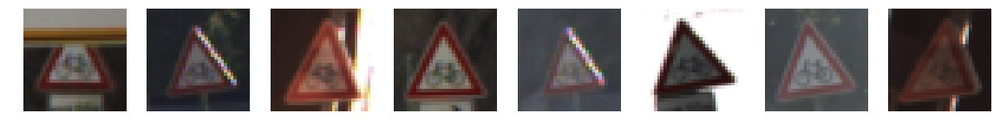


    Class  30 -- Beware of ice/snow  # Samples: 390


    Class  31 -- Wild animals crossing  # Samples: 690


    Class  32 -- End of all speed and passing limits  # Samples: 210


    Class  33 -- Turn right ahead  # Samples: 599


    Class  34 -- Turn left ahead  # Samples: 360


    Class  35 -- Ahead only  # Samples: 1080


    Class  36 -- Go straight or right  # Samples: 330


    Class  37 -- Go straight or left  # Samples: 180


    Class  38 -- Keep right  # Samples: 1860


    Class  39 -- Keep left  # Samples: 270


    Class  40 -- Roundabout mandatory  # Samples: 300


    Class  41 -- End of no passing  # Samples: 210


    Class  42 -- End of no passing by vehicles over 3.5 metric tons  # Samples: 210


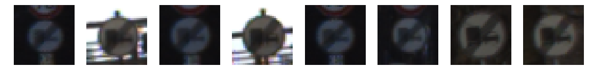


```python
# Show the Distribution of the trainning data

sign_classes, class_indices, class_counts = np.unique(y_train, return_index = True, return_counts = True)
plt.figure()
plt.title('Training Data Distribution')

plt.bar(np.arange(n_classes), class_counts, align='center' )
```


    <Container object of 43 artists>


Since there are lower number of samples for certain class in the training set, I want to create some "fake" data to fill those gap in order prepare our model for a better accuracy across all classes.

----

## Step 2: Design and Test a Model Architecture

Design and implement a deep learning model that learns to recognize traffic signs. Train and test your model on the [German Traffic Sign Dataset](http://benchmark.ini.rub.de/?section=gtsrb&subsection=dataset).

The LeNet-5 implementation shown in the [classroom](https://classroom.udacity.com/nanodegrees/nd013/parts/fbf77062-5703-404e-b60c-95b78b2f3f9e/modules/6df7ae49-c61c-4bb2-a23e-6527e69209ec/lessons/601ae704-1035-4287-8b11-e2c2716217ad/concepts/d4aca031-508f-4e0b-b493-e7b706120f81) at the end of the CNN lesson is a solid starting point. You'll have to change the number of classes and possibly the preprocessing, but aside from that it's plug and play! 

With the LeNet-5 solution from the lecture, you should expect a validation set accuracy of about 0.89. To meet specifications, the validation set accuracy will need to be at least 0.93. It is possible to get an even higher accuracy, but 0.93 is the minimum for a successful project submission. 

There are various aspects to consider when thinking about this problem:

- Neural network architecture (is the network over or underfitting?)
- Play around preprocessing techniques (normalization, rgb to grayscale, etc)
- Number of examples per label (some have more than others).
- Generate fake data.

Here is an example of a [published baseline model on this problem](http://yann.lecun.com/exdb/publis/pdf/sermanet-ijcnn-11.pdf). It's not required to be familiar with the approach used in the paper but, it's good practice to try to read papers like these.

### Pre-process the Data Set (normalization, grayscale, etc.)

Minimally, the image data should be normalized so that the data has mean zero and equal variance. For image data, `(pixel - 128)/ 128` is a quick way to approximately normalize the data and can be used in this project. 

Other pre-processing steps are optional. You can try different techniques to see if it improves performance. 

Use the code cell (or multiple code cells, if necessary) to implement the first step of your project.


```python
import cv2
from skimage import exposure
def process_img(image):  
    # Perform Gamma Correction
    image = np.power(image,0.65)  
    grey_scale_weight = [0.2989, 0.5870, 0.1140]    
    result = np.dot(image,grey_scale_weight)  
    result = (result - 128)/128  
    return result[...,np.newaxis]
# This code is reference from below link. The image process result would light up and show the contours of the image better
# https://navoshta.com/traffic-signs-classification/
def norm_img_ahe(image):
    grey_scale_weight = [0.2989, 0.5870, 0.1140]
    result = np.dot(image,grey_scale_weight)
    result = (result/255.).astype(np.float32)
    for i in range(result.shape[0]):
        result[i] = exposure.equalize_adapthist(result[i])
        
#     result = (result - 128)/128
      
    return result[...,np.newaxis]

# Reference https://github.com/vxy10/ImageAugmentation
def transform_img (img,ang_range,shear_range,trans_range):
    '''
    This function transforms images to generate new images.
    The function takes in following arguments,
    1- Image
    2- ang_range: Range of angles for rotation
    3- shear_range: Range of values to apply affine transform to
    4- trans_range: Range of values to apply translations over.

    A Random uniform distribution is used to generate different parameters for transformation

    '''
     # Rotation
    ang_rot = np.random.uniform(ang_range)-ang_range/2
    rows,cols,ch = img.shape    
    Rot_M = cv2.getRotationMatrix2D((cols/2,rows/2),ang_rot,1)

    # Translation
    tr_x = trans_range*np.random.uniform()-trans_range/2
    tr_y = trans_range*np.random.uniform()-trans_range/2
    Trans_M = np.float32([[1,0,tr_x],[0,1,tr_y]])

    # Shear
    pts1 = np.float32([[5,5],[20,5],[5,20]])

    pt1 = 5+shear_range*np.random.uniform()-shear_range/2
    pt2 = 20+shear_range*np.random.uniform()-shear_range/2

    # Brightness


    pts2 = np.float32([[pt1,5],[pt2,pt1],[5,pt2]])

    shear_M = cv2.getAffineTransform(pts1,pts2)

    img = cv2.warpAffine(img,Rot_M,(cols,rows))
    img = cv2.warpAffine(img,Trans_M,(cols,rows))
    img = cv2.warpAffine(img,shear_M,(cols,rows))
    
    
    return img
    
```


```python
# Testing exposure.equalize_adapthist on training Images
%time x_train = norm_img_ahe(X_train)
```

    /opt/conda/lib/python3.6/site-packages/skimage/util/dtype.py:141: UserWarning: Possible precision loss when converting from float32 to uint16
      .format(dtypeobj_in, dtypeobj_out))


    CPU times: user 5min 49s, sys: 1.06 s, total: 5min 50s
    Wall time: 6min


```python
_ = display_random_data(x_train,y_train,signnames,load_index=saved_index)
```

    Class  0 -- Speed limit (20km/h)  # Samples: 180


    /opt/conda/lib/python3.6/site-packages/ipykernel_launcher.py:15: FutureWarning: comparison to `None` will result in an elementwise object comparison in the future.
      from ipykernel import kernelapp as app


    Class  1 -- Speed limit (30km/h)  # Samples: 1980


    Class  2 -- Speed limit (50km/h)  # Samples: 2010


    Class  3 -- Speed limit (60km/h)  # Samples: 1260


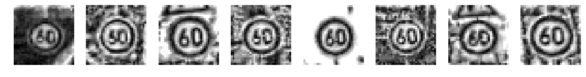


    Class  4 -- Speed limit (70km/h)  # Samples: 1770


    Class  5 -- Speed limit (80km/h)  # Samples: 1650


    Class  6 -- End of speed limit (80km/h)  # Samples: 360


    Class  7 -- Speed limit (100km/h)  # Samples: 1290


    Class  8 -- Speed limit (120km/h)  # Samples: 1260


    Class  9 -- No passing  # Samples: 1320


    Class  10 -- No passing for vehicles over 3.5 metric tons  # Samples: 1800


    Class  11 -- Right-of-way at the next intersection  # Samples: 1170


    Class  12 -- Priority road  # Samples: 1890


    Class  13 -- Yield  # Samples: 1920


    Class  14 -- Stop  # Samples: 690


    Class  15 -- No vehicles  # Samples: 540


    Class  16 -- Vehicles over 3.5 metric tons prohibited  # Samples: 360


    Class  17 -- No entry  # Samples: 990


    Class  18 -- General caution  # Samples: 1080


    Class  19 -- Dangerous curve to the left  # Samples: 180


    Class  20 -- Dangerous curve to the right  # Samples: 300


    Class  21 -- Double curve  # Samples: 270


    Class  22 -- Bumpy road  # Samples: 330


    Class  23 -- Slippery road  # Samples: 450


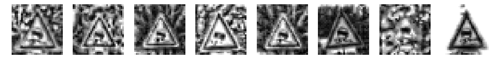


    Class  24 -- Road narrows on the right  # Samples: 240


    Class  25 -- Road work  # Samples: 1350


    Class  26 -- Traffic signals  # Samples: 540


    Class  27 -- Pedestrians  # Samples: 210


    Class  28 -- Children crossing  # Samples: 480


    Class  29 -- Bicycles crossing  # Samples: 240


    Class  30 -- Beware of ice/snow  # Samples: 390


    Class  31 -- Wild animals crossing  # Samples: 690


    Class  32 -- End of all speed and passing limits  # Samples: 210


    Class  33 -- Turn right ahead  # Samples: 599


    Class  34 -- Turn left ahead  # Samples: 360


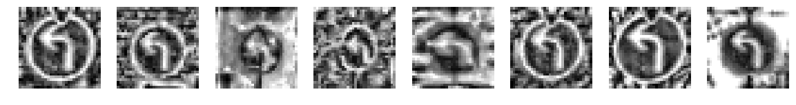


    Class  35 -- Ahead only  # Samples: 1080


    Class  36 -- Go straight or right  # Samples: 330


    Class  37 -- Go straight or left  # Samples: 180


    Class  38 -- Keep right  # Samples: 1860


    Class  39 -- Keep left  # Samples: 270


    Class  40 -- Roundabout mandatory  # Samples: 300


    Class  41 -- End of no passing  # Samples: 210


    Class  42 -- End of no passing by vehicles over 3.5 metric tons  # Samples: 210


```python
%time x_train_test = process_img(X_train)
```

    CPU times: user 7.87 s, sys: 996 ms, total: 8.87 s
    Wall time: 9.05 s


```python
_ = display_random_data(x_train_test,y_train,signnames,load_index=saved_index)
```

    Class  0 -- Speed limit (20km/h)  # Samples: 180


    /opt/conda/lib/python3.6/site-packages/ipykernel_launcher.py:15: FutureWarning: comparison to `None` will result in an elementwise object comparison in the future.
      from ipykernel import kernelapp as app


    Class  1 -- Speed limit (30km/h)  # Samples: 1980


    Class  2 -- Speed limit (50km/h)  # Samples: 2010


    Class  3 -- Speed limit (60km/h)  # Samples: 1260


    Class  4 -- Speed limit (70km/h)  # Samples: 1770


    Class  5 -- Speed limit (80km/h)  # Samples: 1650


    Class  6 -- End of speed limit (80km/h)  # Samples: 360


    Class  7 -- Speed limit (100km/h)  # Samples: 1290


    Class  8 -- Speed limit (120km/h)  # Samples: 1260


    Class  9 -- No passing  # Samples: 1320


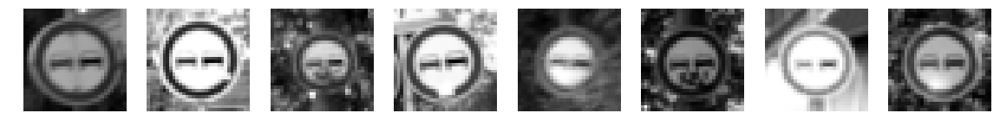


    Class  10 -- No passing for vehicles over 3.5 metric tons  # Samples: 1800


    Class  11 -- Right-of-way at the next intersection  # Samples: 1170


    Class  12 -- Priority road  # Samples: 1890


    Class  13 -- Yield  # Samples: 1920


    Class  14 -- Stop  # Samples: 690


    Class  15 -- No vehicles  # Samples: 540


    Class  16 -- Vehicles over 3.5 metric tons prohibited  # Samples: 360


    Class  17 -- No entry  # Samples: 990


    Class  18 -- General caution  # Samples: 1080


    Class  19 -- Dangerous curve to the left  # Samples: 180


    Class  20 -- Dangerous curve to the right  # Samples: 300


    Class  21 -- Double curve  # Samples: 270


    Class  22 -- Bumpy road  # Samples: 330


    Class  23 -- Slippery road  # Samples: 450


    Class  24 -- Road narrows on the right  # Samples: 240


    Class  25 -- Road work  # Samples: 1350


    Class  26 -- Traffic signals  # Samples: 540


    Class  27 -- Pedestrians  # Samples: 210


    Class  28 -- Children crossing  # Samples: 480


    Class  29 -- Bicycles crossing  # Samples: 240


    Class  30 -- Beware of ice/snow  # Samples: 390


    Class  31 -- Wild animals crossing  # Samples: 690


    Class  32 -- End of all speed and passing limits  # Samples: 210


    Class  33 -- Turn right ahead  # Samples: 599


    Class  34 -- Turn left ahead  # Samples: 360


    Class  35 -- Ahead only  # Samples: 1080


    Class  36 -- Go straight or right  # Samples: 330


    Class  37 -- Go straight or left  # Samples: 180


    Class  38 -- Keep right  # Samples: 1860


    Class  39 -- Keep left  # Samples: 270


    Class  40 -- Roundabout mandatory  # Samples: 300


    Class  41 -- End of no passing  # Samples: 210


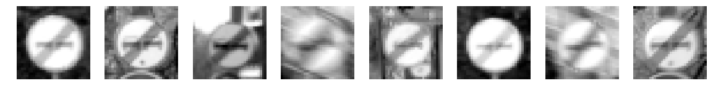


    Class  42 -- End of no passing by vehicles over 3.5 metric tons  # Samples: 210


From the two tests on the image process, the localized histogram localization take a long time to process, but it does result a better result on the output image. However, since we are one a limited GPU time, I am going to run the fast image process.
### Expand the Traning data set
In order to populate the small sample in the training data, I used image augmentation method from https://github.com/vxy10/ImageAugmentation to create more training samples from themselves.


```python
def augment_data_set (x,y,threshold = 1500):
    # Get the unique classes in y label and their indices and class count
    sign_classes, class_indices, class_counts = np.unique(y, return_index = True, return_counts = True)
    aug_x = []
    num_label_added = []
    aug_c = []
    aug_c_index = []
    
    # Loop through those classes
    for c,c_index,c_count in zip(sign_classes, class_indices, class_counts):
        
        # If count number is smaller than the threshold, create more samples based on known samples
        if c_count < threshold:
            num_aug_creating = threshold-c_count
            
            # pick 20 random samples to create augment image sets
            random_index = random.sample(range(c_index,c_index+c_count),50)
            aug_img = []
            
            for i in range(num_aug_creating):
                # Transform a random choice of random index in x array
                aug_img.append(transform_img(x[random.choice(random_index)],1,1,1))
            # Stack the list for later array combine    
            aug_img = np.stack(aug_img)
            # wrap this around in other list for zip and for loop
            aug_x.append(aug_img)
            # Record all other infor with the same length of the array
            num_label_added.append(num_aug_creating)
            aug_c.append(c)
            aug_c_index.append(c_index)
    
    
    # Creating new x and y  
    assert len(aug_x) == len(num_label_added),'aug_x and num_label_added does not match'
    
    # Adding new images and label to original image arrays and labels
    print('Before augment: x shape',x.shape,'yshape',y.shape)

    # To put new images back to orignial array is bit tricky. I need to sort the class indice of the images I am trying to add,
    # And then insert those back to original array in a reverse order. This way the inserting point would not change with added 
    # indices. 
    
    # Zip all the list and convert it back to list to use the sort function
    zipped = list(zip(aug_c_index,aug_c,aug_x,num_label_added))
    result_sort = sorted(zipped, key = lambda x:x[0],reverse=True) # sorting base on the aug_c_index
    
    for c_index,c,aug_img,num_labels in result_sort:
        # adding the aug_img, size (num_labels,32,32,1), back into the x array
        x = np.concatenate((x[:c_index],aug_img,x[c_index:]))
        add_labels = np.array(num_labels*[c])
        
        y = np.concatenate((y[:c_index],add_labels,y[c_index:]))
    print('After augment: x shape',x.shape,'yshape',y.shape)
    return x,y            
```


```python
aug_x,aug_y = augment_data_set(X_train,y_train)

# Show the Distribution of the trainning data again
sign_classes, class_indices, class_counts = np.unique(aug_y, return_index = True, return_counts = True)
plt.figure()
plt.title('Training Data Distribution')

plt.bar(np.arange(n_classes), class_counts, align='center' )
```

    Before augment: x shape (34799, 32, 32, 3) yshape (34799,)
    After augment: x shape (67380, 32, 32, 3) yshape (67380,)


    <Container object of 43 artists>


```python
# Use the AHE and normalization on the all images
# However, this take too much GPU time to process. I am just going to use the faster image process
# aug_x = norm_img_ahe(aug_x)
# x_valid = norm_img_ahe(x_valid)
# x_test = norm_img_ahe(x_test)


# process all the images using fast image process
aug_x = process_img(aug_x)
x_valid = process_img(X_valid)
x_test = process_img(X_test)
```


```python
# Displaying after process images
_ = display_random_data(aug_x,aug_y,signnames)
```

    Class  0 -- Speed limit (20km/h)  # Samples: 1500


    Class  1 -- Speed limit (30km/h)  # Samples: 1980


    Class  2 -- Speed limit (50km/h)  # Samples: 2010


    Class  3 -- Speed limit (60km/h)  # Samples: 1500


    Class  4 -- Speed limit (70km/h)  # Samples: 1770


    Class  5 -- Speed limit (80km/h)  # Samples: 1650


    Class  6 -- End of speed limit (80km/h)  # Samples: 1500


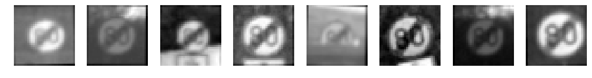


    Class  7 -- Speed limit (100km/h)  # Samples: 1500


    Class  8 -- Speed limit (120km/h)  # Samples: 1500


    Class  9 -- No passing  # Samples: 1500


    Class  10 -- No passing for vehicles over 3.5 metric tons  # Samples: 1800


    Class  11 -- Right-of-way at the next intersection  # Samples: 1500


    Class  12 -- Priority road  # Samples: 1890


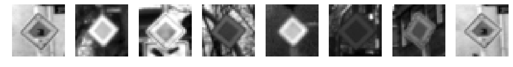


    Class  13 -- Yield  # Samples: 1920


    Class  14 -- Stop  # Samples: 1500


    Class  15 -- No vehicles  # Samples: 1500


    Class  16 -- Vehicles over 3.5 metric tons prohibited  # Samples: 1500


    Class  17 -- No entry  # Samples: 1500


    Class  18 -- General caution  # Samples: 1500


    Class  19 -- Dangerous curve to the left  # Samples: 1500


    Class  20 -- Dangerous curve to the right  # Samples: 1500


    Class  21 -- Double curve  # Samples: 1500


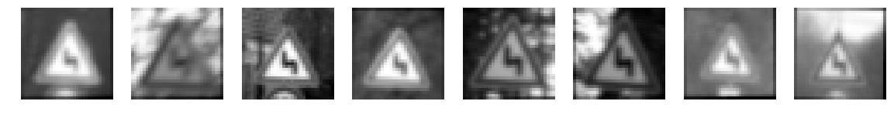


    Class  22 -- Bumpy road  # Samples: 1500


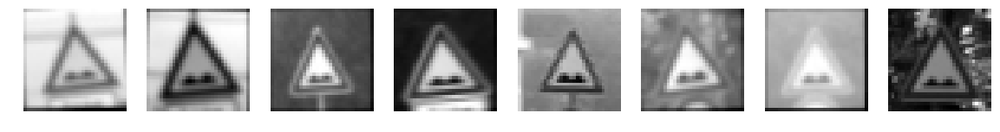


    Class  23 -- Slippery road  # Samples: 1500


    Class  24 -- Road narrows on the right  # Samples: 1500


    Class  25 -- Road work  # Samples: 1500


    Class  26 -- Traffic signals  # Samples: 1500


    Class  27 -- Pedestrians  # Samples: 1500


    Class  28 -- Children crossing  # Samples: 1500


    Class  29 -- Bicycles crossing  # Samples: 1500


    Class  30 -- Beware of ice/snow  # Samples: 1500


    Class  31 -- Wild animals crossing  # Samples: 1500


    Class  32 -- End of all speed and passing limits  # Samples: 1500


    Class  33 -- Turn right ahead  # Samples: 1500


    Class  34 -- Turn left ahead  # Samples: 1500


    Class  35 -- Ahead only  # Samples: 1500


    Class  36 -- Go straight or right  # Samples: 1500


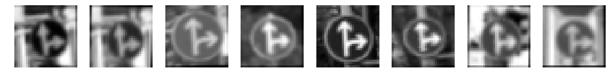


    Class  37 -- Go straight or left  # Samples: 1500


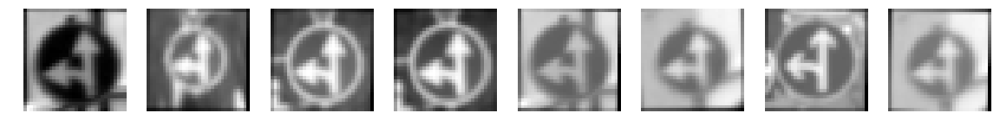


    Class  38 -- Keep right  # Samples: 1860


    Class  39 -- Keep left  # Samples: 1500


    Class  40 -- Roundabout mandatory  # Samples: 1500


    Class  41 -- End of no passing  # Samples: 1500


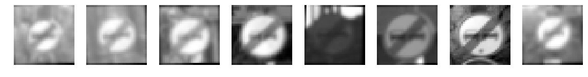


    Class  42 -- End of no passing by vehicles over 3.5 metric tons  # Samples: 1500


```python
from sklearn.utils import shuffle
# Shuffle the training data
x_train, y_train = shuffle(aug_x, aug_y)
```

### Model Architecture


```python
### Define your architecture here.
### Feel free to use as many code cells as needed.

import tensorflow as tf
EPOCHS = 80
BATCH_SIZE = 128
```


```python
from tensorflow.contrib.layers import flatten
def conv2d(x, W, b, strides=1):
    x = tf.nn.conv2d(x, W, strides=[1, strides, strides, 1], padding='VALID')
    x = tf.nn.bias_add(x, b)
    return tf.nn.relu(x)

def maxpool2d(x, k=2):
    return tf.nn.max_pool(
        x,
        ksize=[1, k, k, 1],
        strides=[1, k, k, 1],
        padding='VALID')

# ADD BACK COVNET LAYER AND IMPLMENT LEARNING RATE DECADE
def LeNet(x):    
    # Arguments used for tf.truncated_normal, randomly defines variables for the weights and biases for each layer
    mu = 0
    sigma = 0.1
    
    # Store layers weight & bias
    weights = {
        'wc1': tf.Variable(tf.truncated_normal([5, 5, 1, 16],mean=mu,stddev=sigma)),
        'wc2': tf.Variable(tf.truncated_normal([5, 5, 16, 32],mean=mu,stddev=sigma)),
        'wf1': tf.Variable(tf.truncated_normal([800, 400], mean=mu,stddev=sigma)),
        'wf2': tf.Variable(tf.truncated_normal([400, 200],mean=mu,stddev=sigma)),
        'out': tf.Variable(tf.truncated_normal([200, 43],mean=mu,stddev=sigma))}

    biases = {
        'bc1': tf.Variable(tf.truncated_normal([16],mean=mu,stddev=sigma)),
        'bc2': tf.Variable(tf.truncated_normal([32],mean=mu,stddev=sigma)),
        'bf1': tf.Variable(tf.zeros(400)),
        'bf2': tf.Variable(tf.zeros(200)),
        'out': tf.Variable(tf.zeros(43))}
    
    L2_norm = tf.nn.l2_loss(weights['wc1']) + tf.nn.l2_loss(weights['wc2']) + \
                 tf.nn.l2_loss(weights['wf1']) + tf.nn.l2_loss(weights['wf2']) \
                + tf.nn.l2_loss(weights['out'])
    # TODO: Layer 1: Convolutional, filter 5x5. Input = 32x32x1. Output = 28x28x8.
    convnet1 = conv2d(x,weights['wc1'],biases['bc1'])

    # TODO: Pooling. Input = 28x28x8. Output = 14x14x8.
    convnet1 = maxpool2d(convnet1, k=2)

    # TODO: Layer 2: Convolutional,filter 5x5. Output = 10x10x32.
    convnet2 = conv2d(convnet1,weights['wc2'],biases['bc2'])

    # TODO: Pooling. Input = 10x10x32. Output = 5x5x32.
    convnet2 = maxpool2d(convnet2,k=2)
#     convnet2 = tf.nn.dropout(convnet2,0.9)
    
#     # TODO: Layer 3: Convolutional, filter 2x2 . Output = 4x4x84.
#     convnet3 = conv2d(convnet2,weights['wc3'],biases['bc3'])
    
#     # TODO: Pooling. Input = 4x4x64. Output = 2x2x84.
#     convnet3 = maxpool2d(convnet3,k=2)

    # TODO: Flatten. Input = 2x2x84. Output = 336.
    fc0 = flatten(convnet2)

    # TODO: Layer 4: Fully Connected. Input = 336. Output = 215.
    fc1 = tf.add(tf.matmul(fc0,weights['wf1']),biases['bf1'])
    
    # TODO: Activation.
    fc1 = tf.nn.relu(fc1)
    fc1 = tf.nn.dropout(fc1,0.75)
    
    # TODO: Layer 5: Fully Connected. Input = 215. Output = 100.
    fc2 = tf.add(tf.matmul(fc1,weights['wf2']),biases['bf2'])
    
    # TODO: Activation.
    fc2 = tf.nn.relu(fc2)
    fc2 = tf.nn.dropout(fc2,0.75)

    # TODO: Layer 7: Fully Connected. Input = 100. Output = 43.
    logits = tf.add(tf.matmul(fc2,weights['out']),biases['out'])
    
    return logits, L2_norm,convnet1,convnet2,fc1,fc2


def LeNet_3(x):    
    # Arguments used for tf.truncated_normal, randomly defines variables for the weights and biases for each layer
    mu = 0
    sigma = 0.1
    
    # Store layers weight & bias
    weights = {
        'wc1': tf.Variable(tf.truncated_normal([5, 5, 1, 16],mean=mu,stddev=sigma)),
        'wc2': tf.Variable(tf.truncated_normal([5, 5, 16, 32],mean=mu,stddev=sigma)),
        'wc3': tf.Variable(tf.truncated_normal([2, 2, 32, 64],mean=mu,stddev=sigma)),
        'wf1': tf.Variable(tf.truncated_normal([256, 180], mean=mu,stddev=sigma)),
        'wf2': tf.Variable(tf.truncated_normal([180, 90],mean=mu,stddev=sigma)),
        'out': tf.Variable(tf.truncated_normal([90, 43],mean=mu,stddev=sigma))}

    biases = {
        'bc1': tf.Variable(tf.truncated_normal([16],mean=mu,stddev=sigma)),
        'bc2': tf.Variable(tf.truncated_normal([32],mean=mu,stddev=sigma)),
        'bc3': tf.Variable(tf.truncated_normal([64],mean=mu,stddev=sigma)),
        'bf1': tf.Variable(tf.zeros(180)),
        'bf2': tf.Variable(tf.zeros(90)),
        'out': tf.Variable(tf.zeros(43))}
    #Include L2 regularization 
    L2_norm = tf.nn.l2_loss(weights['wc1']) + tf.nn.l2_loss(weights['wc2']) + \
                tf.nn.l2_loss(weights['wc3']) + tf.nn.l2_loss(weights['wf1']) + tf.nn.l2_loss(weights['wf2']) \
                + tf.nn.l2_loss(weights['out'])
    
    # TODO: Layer 1: Convolutional, filter 5x5. Input = 32x32x1. Output = 28x28x8.
    convnet1 = conv2d(x,weights['wc1'],biases['bc1'])

    # TODO: Pooling. Input = 28x28x8. Output = 14x14x8.
    convnet1 = maxpool2d(convnet1, k=2)

    # TODO: Layer 2: Convolutional,filter 5x5. Output = 10x10x32.
    convnet2 = conv2d(convnet1,weights['wc2'],biases['bc2'])

    # TODO: Pooling. Input = 10x10x32. Output = 5x5x32.
    convnet2 = maxpool2d(convnet2,k=2)
    convnet2 = tf.nn.dropout(convnet2,0.9)
    
    # TODO: Layer 3: Convolutional, filter 2x2 . Output = 4x4x64.
    convnet3 = conv2d(convnet2,weights['wc3'],biases['bc3'])
    
    # TODO: Pooling. Input = 4x4x64. Output = 2x2x64.
    convnet3 = maxpool2d(convnet3,k=2)

    # TODO: Flatten. Input = 2x2x64. Output = 256.
    fc0 = flatten(convnet3)

    # TODO: Layer 4: Fully Connected. Input = 256. Output = 215.
    fc1 = tf.add(tf.matmul(fc0,weights['wf1']),biases['bf1'])
    
    # TODO: Activation.
    fc1 = tf.nn.relu(fc1)
    fc1 = tf.nn.dropout(fc1,0.75)
    
    # TODO: Layer 5: Fully Connected. Input = 215. Output = 100.
    fc2 = tf.add(tf.matmul(fc1,weights['wf2']),biases['bf2'])
    
    # TODO: Activation.
    fc2 = tf.nn.relu(fc2)
    fc2 = tf.nn.dropout(fc2,0.75)

    # TODO: Layer 7: Fully Connected. Input = 100. Output = 43.
    logits = tf.add(tf.matmul(fc2,weights['out']),biases['out'])
    
    return logits, L2_norm,convnet1,convnet2,convnet3,fc1,fc2
```

### Train, Validate and Test the Model

A validation set can be used to assess how well the model is performing. A low accuracy on the training and validation
sets imply underfitting. A high accuracy on the training set but low accuracy on the validation set implies overfitting.


```python
### Train your model here.
### Calculate and report the accuracy on the training and validation set.
### Once a final model architecture is selected, 
### the accuracy on the test set should be calculated and reported as well.
### Feel free to use as many code cells as needed.

x = tf.placeholder(tf.float32, (None, 32, 32, 1))
y = tf.placeholder(tf.int32, (None))
one_hot_y = tf.one_hot(y, 43)

rate = 0.0005
beta = 0.001

logits,L2_norm,convnet1,convnet2,fc1,fc2 = LeNet(x)
# logits,L2_norm,convnet1,convnet2,convnet3,fc1,fc2 = LeNet_3(x)
cross_entropy = tf.nn.softmax_cross_entropy_with_logits(labels=one_hot_y, logits=logits)
loss_operation = tf.reduce_mean(cross_entropy)
optimizer = tf.train.AdamOptimizer(learning_rate = rate)
training_operation = optimizer.minimize(loss_operation)
```

#### Model Evaluation


```python
correct_prediction = tf.equal(tf.argmax(logits, 1), tf.argmax(one_hot_y, 1))
accuracy_operation = tf.reduce_mean(tf.cast(correct_prediction, tf.float32))
saver = tf.train.Saver()

def evaluate(X_data, y_data):
    num_examples = len(X_data)
    total_accuracy = 0
    sess = tf.get_default_session()
    for offset in range(0, num_examples, BATCH_SIZE):
        batch_x, batch_y = X_data[offset:offset+BATCH_SIZE], y_data[offset:offset+BATCH_SIZE]
        accuracy = sess.run(accuracy_operation, feed_dict={x: batch_x, y: batch_y})
        total_accuracy += (accuracy * len(batch_x))
    return total_accuracy / num_examples
```

### Training session


```python
with tf.Session() as sess:
    sess.run(tf.global_variables_initializer())
    num_examples = len(x_train)
    
    print("Training...")
    print()
    for i in range(EPOCHS):
        x_train, y_train = shuffle(x_train, y_train)
        for offset in range(0, num_examples, BATCH_SIZE):
            end = offset + BATCH_SIZE
            batch_x, batch_y = x_train[offset:end], y_train[offset:end]
            sess.run(training_operation, feed_dict={x: batch_x, y: batch_y})
        
        training_accuracy = evaluate(x_train, y_train)    
        validation_accuracy = evaluate(x_valid, y_valid)
        print("EPOCH {} ...".format(i+1))
        print("Training Accuracy = {:.3f}".format(training_accuracy))
        print("Validation Accuracy = {:.3f}".format(validation_accuracy))
        print()
        
    saver.save(sess, './lenet')
    print("Model saved")
```

    Training...
    
    EPOCH 1 ...
    Training Accuracy = 0.279
    Validation Accuracy = 0.214
    
    EPOCH 2 ...
    Training Accuracy = 0.666
    Validation Accuracy = 0.580
    
    EPOCH 3 ...
    Training Accuracy = 0.780
    Validation Accuracy = 0.696
    
    EPOCH 4 ...
    Training Accuracy = 0.847
    Validation Accuracy = 0.770
    
    EPOCH 5 ...
    Training Accuracy = 0.889
    Validation Accuracy = 0.806
    
    EPOCH 6 ...
    Training Accuracy = 0.913
    Validation Accuracy = 0.823
    
    EPOCH 7 ...
    Training Accuracy = 0.926
    Validation Accuracy = 0.825
    
    EPOCH 8 ...
    Training Accuracy = 0.940
    Validation Accuracy = 0.853
    
    EPOCH 9 ...
    Training Accuracy = 0.946
    Validation Accuracy = 0.863
    
    EPOCH 10 ...
    Training Accuracy = 0.956
    Validation Accuracy = 0.865
    
    EPOCH 11 ...
    Training Accuracy = 0.963
    Validation Accuracy = 0.878
    
    EPOCH 12 ...
    Training Accuracy = 0.956
    Validation Accuracy = 0.856
    
    EPOCH 13 ...
    Training Accuracy = 0.965
    Validation Accuracy = 0.876
    
    EPOCH 14 ...
    Training Accuracy = 0.968
    Validation Accuracy = 0.886
    
    EPOCH 15 ...
    Training Accuracy = 0.972
    Validation Accuracy = 0.887
    
    EPOCH 16 ...
    Training Accuracy = 0.978
    Validation Accuracy = 0.893
    
    EPOCH 17 ...
    Training Accuracy = 0.977
    Validation Accuracy = 0.898
    
    EPOCH 18 ...
    Training Accuracy = 0.979
    Validation Accuracy = 0.904
    
    EPOCH 19 ...
    Training Accuracy = 0.981
    Validation Accuracy = 0.898
    
    EPOCH 20 ...
    Training Accuracy = 0.984
    Validation Accuracy = 0.898
    
    EPOCH 21 ...
    Training Accuracy = 0.985
    Validation Accuracy = 0.898
    
    EPOCH 22 ...
    Training Accuracy = 0.986
    Validation Accuracy = 0.912
    
    EPOCH 23 ...
    Training Accuracy = 0.985
    Validation Accuracy = 0.901
    
    EPOCH 24 ...
    Training Accuracy = 0.988
    Validation Accuracy = 0.912
    
    EPOCH 25 ...
    Training Accuracy = 0.989
    Validation Accuracy = 0.913
    
    EPOCH 26 ...
    Training Accuracy = 0.989
    Validation Accuracy = 0.918
    
    EPOCH 27 ...
    Training Accuracy = 0.990
    Validation Accuracy = 0.915
    
    EPOCH 28 ...
    Training Accuracy = 0.991
    Validation Accuracy = 0.921
    
    EPOCH 29 ...
    Training Accuracy = 0.993
    Validation Accuracy = 0.926
    
    EPOCH 30 ...
    Training Accuracy = 0.991
    Validation Accuracy = 0.927
    
    EPOCH 31 ...
    Training Accuracy = 0.994
    Validation Accuracy = 0.923
    
    EPOCH 32 ...
    Training Accuracy = 0.994
    Validation Accuracy = 0.929
    
    EPOCH 33 ...
    Training Accuracy = 0.993
    Validation Accuracy = 0.927
    
    EPOCH 34 ...
    Training Accuracy = 0.994
    Validation Accuracy = 0.926
    
    EPOCH 35 ...
    Training Accuracy = 0.995
    Validation Accuracy = 0.925
    
    EPOCH 36 ...
    Training Accuracy = 0.995
    Validation Accuracy = 0.936
    
    EPOCH 37 ...
    Training Accuracy = 0.995
    Validation Accuracy = 0.933
    
    EPOCH 38 ...
    Training Accuracy = 0.995
    Validation Accuracy = 0.931
    
    EPOCH 39 ...
    Training Accuracy = 0.995
    Validation Accuracy = 0.934
    
    EPOCH 40 ...
    Training Accuracy = 0.992
    Validation Accuracy = 0.920
    
    EPOCH 41 ...
    Training Accuracy = 0.996
    Validation Accuracy = 0.930
    
    EPOCH 42 ...
    Training Accuracy = 0.995
    Validation Accuracy = 0.939
    
    EPOCH 43 ...
    Training Accuracy = 0.997
    Validation Accuracy = 0.937
    
    EPOCH 44 ...
    Training Accuracy = 0.997
    Validation Accuracy = 0.941
    
    EPOCH 45 ...
    Training Accuracy = 0.996
    Validation Accuracy = 0.936
    
    EPOCH 46 ...
    Training Accuracy = 0.996
    Validation Accuracy = 0.940
    
    EPOCH 47 ...
    Training Accuracy = 0.997
    Validation Accuracy = 0.937
    
    EPOCH 48 ...
    Training Accuracy = 0.997
    Validation Accuracy = 0.940
    
    EPOCH 49 ...
    Training Accuracy = 0.996
    Validation Accuracy = 0.931
    
    EPOCH 50 ...
    Training Accuracy = 0.996
    Validation Accuracy = 0.934
    
    EPOCH 51 ...
    Training Accuracy = 0.997
    Validation Accuracy = 0.941
    
    EPOCH 52 ...
    Training Accuracy = 0.996
    Validation Accuracy = 0.933
    
    EPOCH 53 ...
    Training Accuracy = 0.997
    Validation Accuracy = 0.929
    
    EPOCH 54 ...
    Training Accuracy = 0.998
    Validation Accuracy = 0.940
    
    EPOCH 55 ...
    Training Accuracy = 0.997
    Validation Accuracy = 0.938
    
    EPOCH 56 ...
    Training Accuracy = 0.997
    Validation Accuracy = 0.939
    
    EPOCH 57 ...
    Training Accuracy = 0.997
    Validation Accuracy = 0.929
    
    EPOCH 58 ...
    Training Accuracy = 0.997
    Validation Accuracy = 0.945
    
    EPOCH 59 ...
    Training Accuracy = 0.998
    Validation Accuracy = 0.939
    
    EPOCH 60 ...
    Training Accuracy = 0.997
    Validation Accuracy = 0.942
    
    EPOCH 61 ...
    Training Accuracy = 0.996
    Validation Accuracy = 0.933
    
    EPOCH 62 ...
    Training Accuracy = 0.998
    Validation Accuracy = 0.942
    
    EPOCH 63 ...
    Training Accuracy = 0.998
    Validation Accuracy = 0.941
    
    EPOCH 64 ...
    Training Accuracy = 0.997
    Validation Accuracy = 0.940
    
    EPOCH 65 ...
    Training Accuracy = 0.997
    Validation Accuracy = 0.937
    
    EPOCH 66 ...
    Training Accuracy = 0.996
    Validation Accuracy = 0.931
    
    EPOCH 67 ...
    Training Accuracy = 0.998
    Validation Accuracy = 0.943
    
    EPOCH 68 ...
    Training Accuracy = 0.997
    Validation Accuracy = 0.933
    
    EPOCH 69 ...
    Training Accuracy = 0.998
    Validation Accuracy = 0.941
    
    EPOCH 70 ...
    Training Accuracy = 0.998
    Validation Accuracy = 0.944
    
    EPOCH 71 ...
    Training Accuracy = 0.998
    Validation Accuracy = 0.937
    
    EPOCH 72 ...
    Training Accuracy = 0.998
    Validation Accuracy = 0.951
    
    EPOCH 73 ...
    Training Accuracy = 0.998
    Validation Accuracy = 0.946
    
    EPOCH 74 ...
    Training Accuracy = 0.998
    Validation Accuracy = 0.942
    
    EPOCH 75 ...
    Training Accuracy = 0.998
    Validation Accuracy = 0.939
    
    EPOCH 76 ...
    Training Accuracy = 0.998
    Validation Accuracy = 0.931
    
    EPOCH 77 ...
    Training Accuracy = 0.997
    Validation Accuracy = 0.937
    
    EPOCH 78 ...
    Training Accuracy = 0.998
    Validation Accuracy = 0.941
    
    EPOCH 79 ...
    Training Accuracy = 0.998
    Validation Accuracy = 0.941
    
    EPOCH 80 ...
    Training Accuracy = 0.997
    Validation Accuracy = 0.934
    
    Model saved


### Using the test data


```python
with tf.Session() as sess:
    saver.restore(sess, tf.train.latest_checkpoint('.'))

    test_accuracy = evaluate(x_test, y_test)
    print("Test Accuracy = {:.3f}".format(test_accuracy))
```

    INFO:tensorflow:Restoring parameters from ./lenet
    Test Accuracy = 0.917


---

## Step 3: Test a Model on New Images

To give yourself more insight into how your model is working, download at least five pictures of German traffic signs from the web and use your model to predict the traffic sign type.

You may find `signnames.csv` useful as it contains mappings from the class id (integer) to the actual sign name.

### Load and Output the Images


```python
### Load the images and plot them here.
### Feel free to use as many code cells as needed.
import matplotlib.image as mpimg
import glob
import cv2
import numpy as np

my_web_x = []
my_web_y = []
folder_name='web_images/'

for image_file in glob.glob(folder_name + '*.jpeg'):
    image = cv2.resize(np.array(mpimg.imread(image_file)),(32,32))
    my_web_x.append(process_img(image))
    my_web_y.append(int(image_file[len(folder_name):(len(folder_name)+2)]))

for image_file in glob.glob(folder_name + '*.png'):
    image = cv2.cvtColor(mpimg.imread(image_file),cv2.COLOR_RGBA2RGB)
#     print(image.shape)
    my_web_x.append(process_img(image))
    my_web_y.append(int(image_file[len(folder_name):(len(folder_name)+2)]))
    
print(my_web_y[3])
# print (my_web_x)

plt.imshow(my_web_x[4].squeeze(),cmap='gray')


```

    3


    <matplotlib.image.AxesImage at 0x7fd579f66710>


### Predict the Sign Type for Each Image


```python
### Run the predictions here and use the model to output the prediction for each image.
### Make sure to pre-process the images with the same pre-processing pipeline used earlier.
### Feel free to use as many code cells as needed.
prediction=tf.argmax(logits,1)
with tf.Session() as sess:
    saver.restore(sess, tf.train.latest_checkpoint('.'))
    prediction = sess.run(prediction,feed_dict={x: my_web_x})
    print ("predictions", prediction)
print('labels:',my_web_y)
### Calculate the accuracy for these 5 new images. 
### For example, if the model predicted 1 out of 5 signs correctly, it's 20% accurate on these new images.
accur = 0
for i in range(len(prediction)):
    if prediction[i] == my_web_y[i]:
        accur += 1
print('Total accuracy:',accur/len(prediction))
```

    INFO:tensorflow:Restoring parameters from ./lenet
    predictions [38 28 19  3  3]
    labels: [38, 28, 25, 3, 34]
    Total accuracy: 0.6


### Output Top 5 Softmax Probabilities For Each Image Found on the Web

For each of the new images, print out the model's softmax probabilities to show the **certainty** of the model's predictions (limit the output to the top 5 probabilities for each image). [`tf.nn.top_k`](https://www.tensorflow.org/versions/r0.12/api_docs/python/nn.html#top_k) could prove helpful here. 

The example below demonstrates how tf.nn.top_k can be used to find the top k predictions for each image.

`tf.nn.top_k` will return the values and indices (class ids) of the top k predictions. So if k=3, for each sign, it'll return the 3 largest probabilities (out of a possible 43) and the correspoding class ids.

Take this numpy array as an example. The values in the array represent predictions. The array contains softmax probabilities for five candidate images with six possible classes. `tf.nn.top_k` is used to choose the three classes with the highest probability:

```
# (5, 6) array
a = np.array([[ 0.24879643,  0.07032244,  0.12641572,  0.34763842,  0.07893497,
         0.12789202],
       [ 0.28086119,  0.27569815,  0.08594638,  0.0178669 ,  0.18063401,
         0.15899337],
       [ 0.26076848,  0.23664738,  0.08020603,  0.07001922,  0.1134371 ,
         0.23892179],
       [ 0.11943333,  0.29198961,  0.02605103,  0.26234032,  0.1351348 ,
         0.16505091],
       [ 0.09561176,  0.34396535,  0.0643941 ,  0.16240774,  0.24206137,
         0.09155967]])
```

Running it through `sess.run(tf.nn.top_k(tf.constant(a), k=3))` produces:

```
TopKV2(values=array([[ 0.34763842,  0.24879643,  0.12789202],
       [ 0.28086119,  0.27569815,  0.18063401],
       [ 0.26076848,  0.23892179,  0.23664738],
       [ 0.29198961,  0.26234032,  0.16505091],
       [ 0.34396535,  0.24206137,  0.16240774]]), indices=array([[3, 0, 5],
       [0, 1, 4],
       [0, 5, 1],
       [1, 3, 5],
       [1, 4, 3]], dtype=int32))
```

Looking just at the first row we get `[ 0.34763842,  0.24879643,  0.12789202]`, you can confirm these are the 3 largest probabilities in `a`. You'll also notice `[3, 0, 5]` are the corresponding indices.


```python
### Print out the top five softmax probabilities for the predictions on the German traffic sign images found on the web. 
### Feel free to use as many code cells as needed.

k_size = 5
soft_max = tf.nn.softmax(logits)
top_k = tf.nn.top_k(soft_max,k=k_size)

with tf.Session() as sess:
    saver.restore(sess, tf.train.latest_checkpoint('.'))
    my_softmax = sess.run(soft_max,feed_dict={x:my_web_x})
    my_top_k = sess.run(top_k,feed_dict={x:my_web_x})
    
fig,axs = plt.subplots(len(my_web_x),k_size+1,figsize=(20,22))
axs = axs.ravel()

for i, image in enumerate(my_web_x):
    offset = (k_size+1)*i
    for j in range(k_size+1):
        axs[offset+j].axis('off')
        if j == 0:
            axs[offset+j].imshow(image.squeeze(),cmap='gray')
            axs[offset+j].set_title('Original')
        else:
            probability =  my_top_k[1][i][j-1]
            valid_index = np.argwhere(y_valid == probability)[0]
            axs[offset+j].imshow(x_valid[valid_index].squeeze(),cmap='gray')
            axs[offset+j].set_title('Top {} Guess:{:.0f}%'.format(j,100*my_top_k[0][i][j-1]))     

```

    INFO:tensorflow:Restoring parameters from ./lenet


### Project Writeup

Once you have completed the code implementation, document your results in a project writeup using this [template](https://github.com/udacity/CarND-Traffic-Sign-Classifier-Project/blob/master/writeup_template.md) as a guide. The writeup can be in a markdown or pdf file. 

> **Note**: Once you have completed all of the code implementations and successfully answered each question above, you may finalize your work by exporting the iPython Notebook as an HTML document. You can do this by using the menu above and navigating to  \n",
    "**File -> Download as -> HTML (.html)**. Include the finished document along with this notebook as your submission.

---

## Step 4 (Optional): Visualize the Neural Network's State with Test Images

 This Section is not required to complete but acts as an additional excersise for understaning the output of a neural network's weights. While neural networks can be a great learning device they are often referred to as a black box. We can understand what the weights of a neural network look like better by plotting their feature maps. After successfully training your neural network you can see what it's feature maps look like by plotting the output of the network's weight layers in response to a test stimuli image. From these plotted feature maps, it's possible to see what characteristics of an image the network finds interesting. For a sign, maybe the inner network feature maps react with high activation to the sign's boundary outline or to the contrast in the sign's painted symbol.

 Provided for you below is the function code that allows you to get the visualization output of any tensorflow weight layer you want. The inputs to the function should be a stimuli image, one used during training or a new one you provided, and then the tensorflow variable name that represents the layer's state during the training process, for instance if you wanted to see what the [LeNet lab's](https://classroom.udacity.com/nanodegrees/nd013/parts/fbf77062-5703-404e-b60c-95b78b2f3f9e/modules/6df7ae49-c61c-4bb2-a23e-6527e69209ec/lessons/601ae704-1035-4287-8b11-e2c2716217ad/concepts/d4aca031-508f-4e0b-b493-e7b706120f81) feature maps looked like for it's second convolutional layer you could enter conv2 as the tf_activation variable.

For an example of what feature map outputs look like, check out NVIDIA's results in their paper [End-to-End Deep Learning for Self-Driving Cars](https://devblogs.nvidia.com/parallelforall/deep-learning-self-driving-cars/) in the section Visualization of internal CNN State. NVIDIA was able to show that their network's inner weights had high activations to road boundary lines by comparing feature maps from an image with a clear path to one without. Try experimenting with a similar test to show that your trained network's weights are looking for interesting features, whether it's looking at differences in feature maps from images with or without a sign, or even what feature maps look like in a trained network vs a completely untrained one on the same sign image.

<figure>
 
 <figcaption>
 <p></p> 
 <p style="text-align: center;"> Your output should look something like this (above)</p> 
 </figcaption>
</figure>
 <p></p> 


```python
### Visualize your network's feature maps here.
### Feel free to use as many code cells as needed.

# image_input: the test image being fed into the network to produce the feature maps
# tf_activation: should be a tf variable name used during your training procedure that represents the calculated state of a specific weight layer
# activation_min/max: can be used to view the activation contrast in more detail, by default matplot sets min and max to the actual min and max values of the output
# plt_num: used to plot out multiple different weight feature map sets on the same block, just extend the plt number for each new feature map entry

def outputFeatureMap(image_input, tf_activation, activation_min=-1, activation_max=-1 ,plt_num=1):
    # Here make sure to preprocess your image_input in a way your network expects
    # with size, normalization, ect if needed
    # image_input =
    # Note: x should be the same name as your network's tensorflow data placeholder variable
    # If you get an error tf_activation is not defined it may be having trouble accessing the variable from inside a function
    activation = tf_activation.eval(session=sess,feed_dict={x : image_input})
    featuremaps = activation.shape[3]
    plt.figure(plt_num, figsize=(15,15))
    for featuremap in range(featuremaps):
        plt.subplot(6,8, featuremap+1) # sets the number of feature maps to show on each row and column
        plt.title('FeatureMap ' + str(featuremap)) # displays the feature map number
        if activation_min != -1 & activation_max != -1:
            plt.imshow(activation[0,:,:, featuremap], interpolation="nearest", vmin =activation_min, vmax=activation_max, cmap="gray")
        elif activation_max != -1:
            plt.imshow(activation[0,:,:, featuremap], interpolation="nearest", vmax=activation_max, cmap="gray")
        elif activation_min !=-1:
            plt.imshow(activation[0,:,:, featuremap], interpolation="nearest", vmin=activation_min, cmap="gray")
        else:
            plt.imshow(activation[0,:,:, featuremap], interpolation="nearest", cmap="gray")
```
